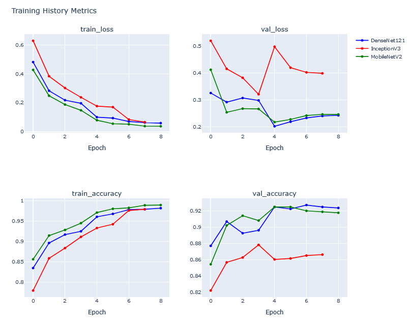

# Image Classification with Transfer Learning

This project applies transfer learning techniques using three prominent CNN architectures: DenseNet121, InceptionV3, and MobileNetV2, for the task of image classification. It is designed to classify images of corn or maize leaf diseases, showcasing the ability to leverage pre-trained models for efficient and accurate classification on a specialized dataset.

## Project Overview

The goal of this project is to demonstrate the application of transfer learning using TensorFlow and Keras, comparing the performance of different architectures on a corn or maize leaf disease dataset. The models are trained on a subset of the data and validated using a separate set to ensure generalization.

### Models Used
- **DenseNet121**: Known for its densely connected convolutional networks.
- **InceptionV3**: Offers a good trade-off between speed and accuracy, with its inception modules.
- **MobileNetV2**: Optimized for mobile devices, providing a good balance between speed and accuracy for on-device computations.

## Dataset

The dataset consists of images categorized into different classes of corn or maize leaf diseases. It is organized into directories for each class, facilitating easy loading and preprocessing.

- Dataset source: Kaggle (Please replace with the actual source link if available)
- Number of classes: (Specify the number of classes)
- Total images: (Specify the total number of images)

## Prerequisites

Before running this project, ensure you have the following installed:
- Python 3.8 or higher
- TensorFlow 2.x
- Keras
- Pandas
- NumPy
- Matplotlib
- Plotly (for advanced visualizations)

